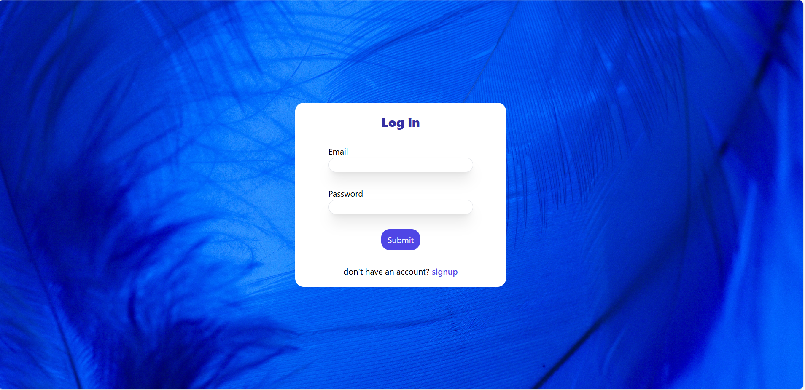
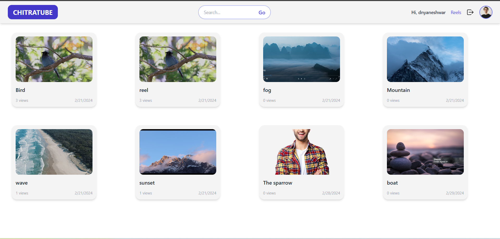
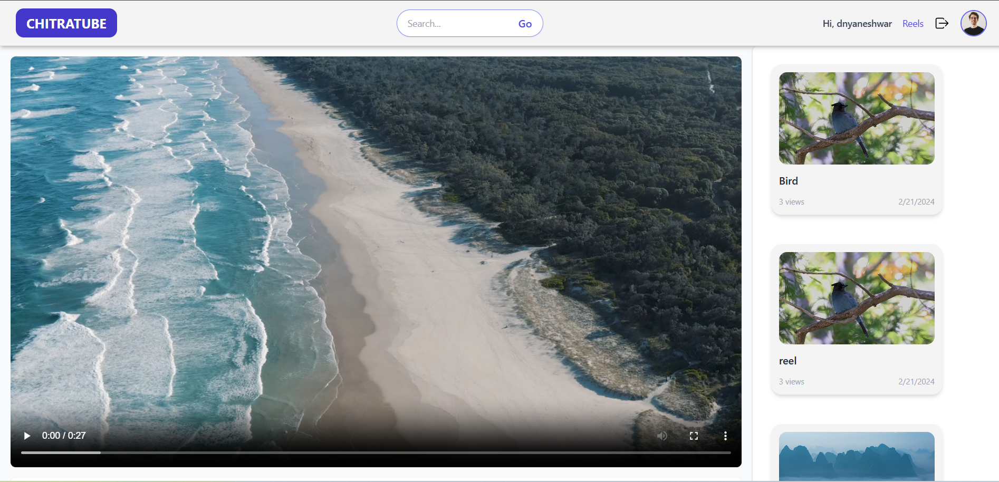
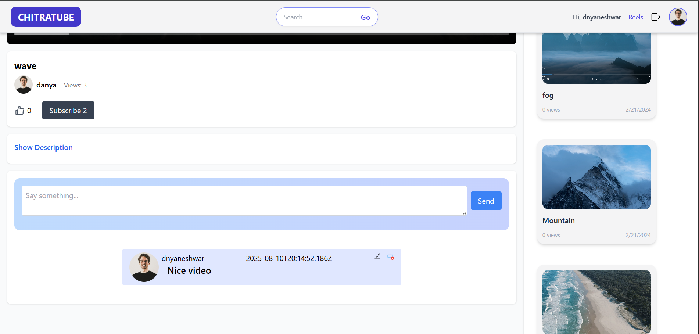

# YouTube-Clone

A modern, responsive YouTube-like web app built with Vite + React. Browse videos, search, like, and explore a clean UI inspired by popular video platforms.

Demo: https://rad-rolypoly-fc44d0.netlify.app/

Features:
- Developed a video-sharing app with authentication, subscriptions, and comment features 
- Clean, responsive UI using modern component patterns
- Video listing, video detail view and player integration
- Search videos by title/keyword
- Like / Save functionality (local state or backend-ready)
- Responsive navigation and mobile-friendly layout
- Smooth animations and accessible keyboard support

Tech Stack:
- Frontend: React (Vite)
- Styling: Tailwind CSS 
- Bundler: Vite 
- Optional: React Router, Context / Redux for state, Cloudinary for media, Node/Express backend

Quick Start:
1. Clone
   git clone [https://github.com/<your-username>/youtube-clone.git](https://github.com/sdnyaneshwar/Youtube-clone.git)
   cd youtube-clone

2. Install
   npm install

3. Environment variables
   Create a .env file in the project root:
   VITE_API_BASE_URL=https://api.example.com
   VITE_YT_API_KEY=your_youtube_api_key_here

4. Run (development)
   npm run dev

5. Build (production)
   npm run build
  

6. Preview production build locally
   npm run preview
 

Screenshots:
LoginPage

Homepage

Video Player

comment section

Contributing:
1. Fork the repo
2. Create a feature branch: git checkout -b feat/awesome-feature
3. Commit changes: git commit -m "feat: add awesome feature"
4. Push and open a PR

License:
This project is licensed under the MIT License.

Contact:
Created by Dnyaneshwar Suwarnkar
GitHub: [https://github.com/<your-username>](https://rad-rolypoly-fc44d0.netlify.app/)
LinkedIn: https://www.linkedin.com/in/dnyaneshwar-suwarnkar/
